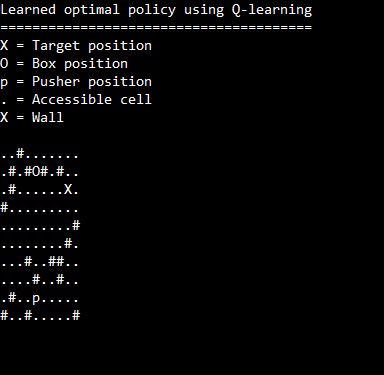
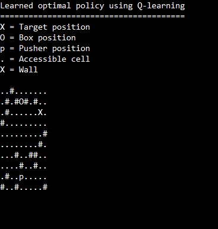

# BoxPusher (Sokoban) solved: Reinforcement Learning vs. BFS
(Problem definition from LeetCode challenge 1263)

RL solution in "RLutils.h"
* Simulated environment: RL::RLField
* Policy class: RL::EpsGreedyPolicy
* Q-learning algo: RL::RL_solve

BFS solution in "BFSutils.h"

Demo:
* RL Solution using a (-1) reward for each step and (+100) for reaching the target   

* RL Solution using a (-1) reward for each step, (-5) for each box move and (+100) for reaching the target  

